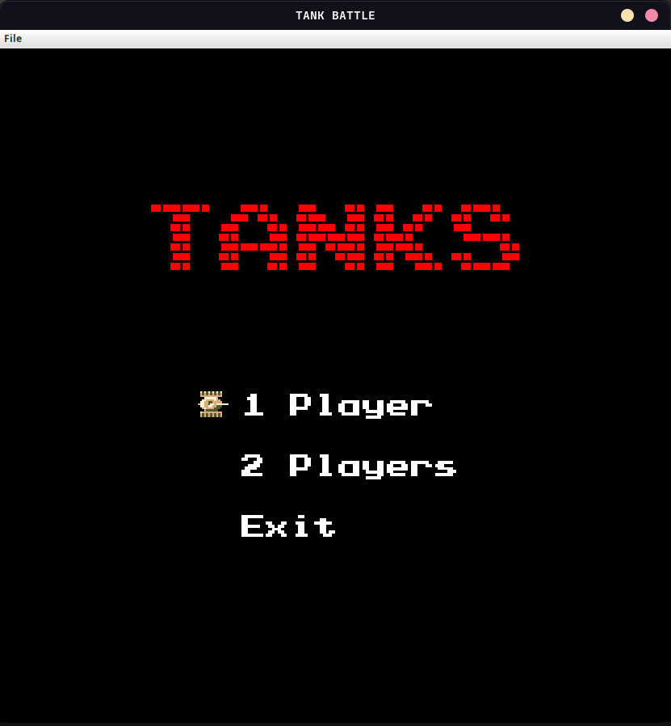
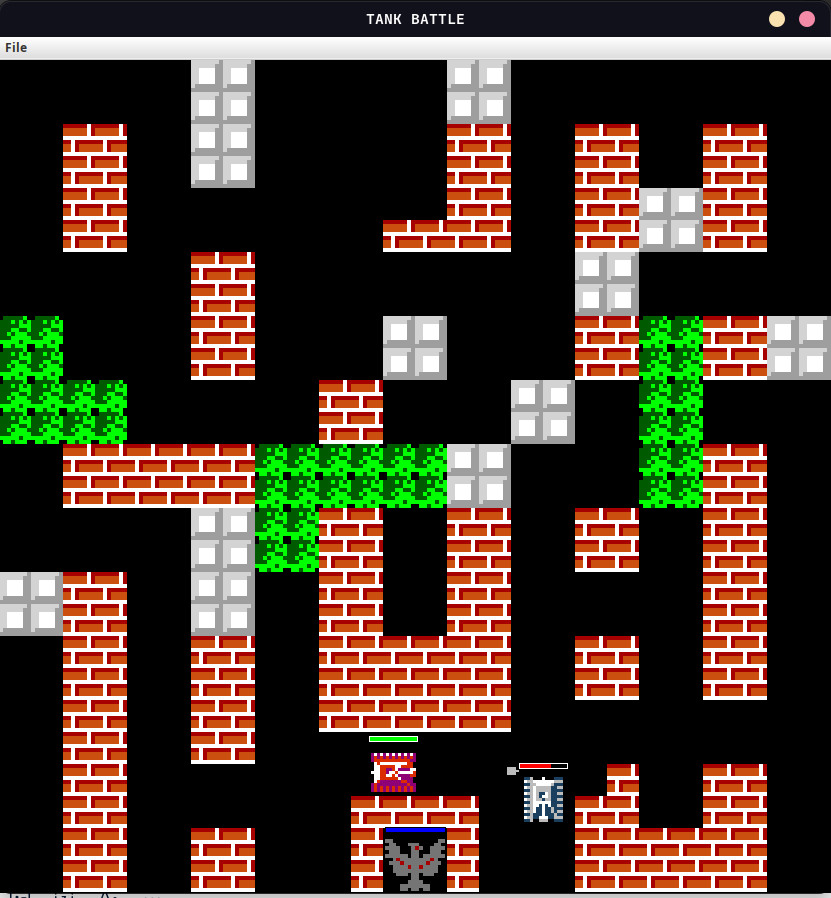

# TanksGame

Implementation of Tank Game.  
A Java Swing project of Object Oriented Programming, CN12-UET.  
Enemy tanks are going to destroy the ally base. The player's mission is to protect the base.   

## Controls:

### Player 1:

- `W` to move `UP`
- `A` to move `LEFT`
- `S` to move `DOWN`
- `D` to move `RIGHT`
- `J` to `FIRE`

### PLayer 2:

- `UpArrow` to move `UP`
- `LeftArrow` to move `LEFT`
- `DownArrow` to move `DOWN`
- `RightArrow` to move `RIGHT`
- `Numpad 1` to `FIRE`

## Tanks

Each tank has up to 3 bullets at the same time, auto reload after 0.3 seconds.  
Ally tanks have 10HP, 1 damage and 2 speed.  
Enemy tanks have 3HP, 1 damage and 1 speed.  

## Levels

Levels are plain text files in that are located in **levels** directory.  
Each level is a two dimensional array with 26 rows and 26 columns.  
Each field in the array should be one of following elements:  

## Objects

- **.** Empty field
- **#**  Brick wall: can be destroyed with three bullets.
- **@**  Stone wall: can't be destroyed.
- **%**  Bush: can't be destroyed but can be passed through and bullets can also shoot through it.
- **~**  Water: can't be destroyed, can't be passed through but bullets can shot thought it.

If bullet hits target, brick or stage border, both of them will damage each other's lives, when the durability of one of them returns to 0, they will be destroyed.

